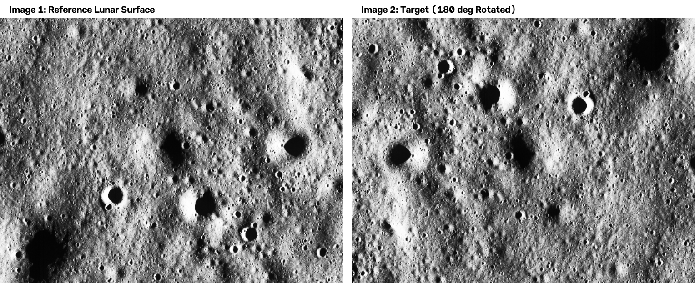
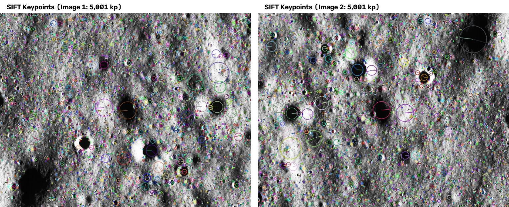
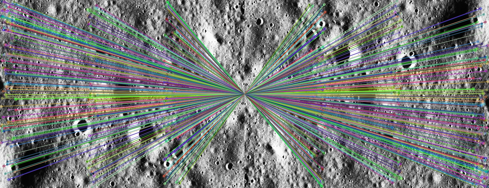
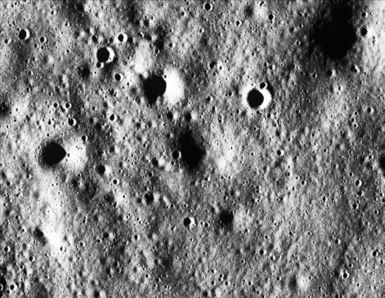
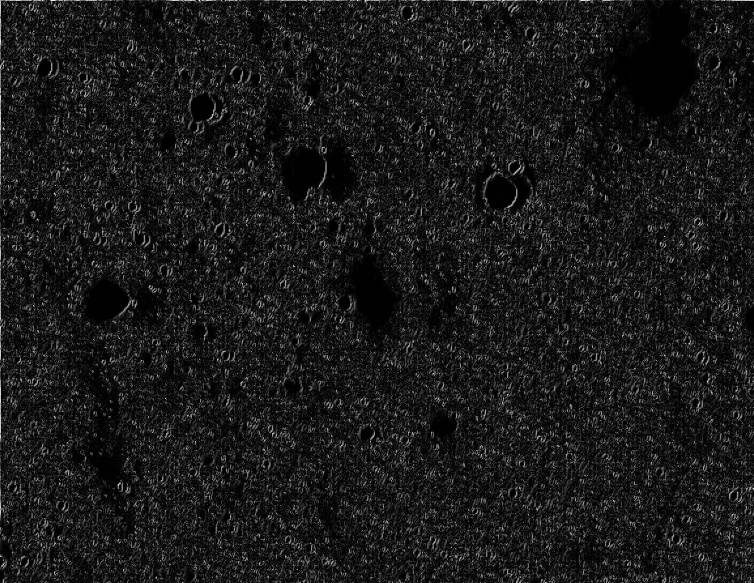

# ATLAS — Lunar Image Correspondence

ATLAS (Automated Feature Matching and Registration for Lunar Remote Sensing) is an ongoing research-oriented framework designed for feature matching, geometric registration, and spatial correspondence across lunar surface imagery.

> **Project Status Notice:** ATLAS is an ongoing research project. The current implementation establishes a classical SIFT-based correspondence and geometric-registration baseline, while multimodal Chandrayaan-2 correspondence remains an active research direction.

---

## Research Problem

Lunar image correspondence is a fundamental computer vision challenge in planetary remote sensing, essential for topographic mapping, landing site selection, change detection, and orbital SLAM. The project addresses the **Smart India Hackathon (SIH) 2026** problem statement:

> *"Multi-modal, Sun angle and scale invariant image correspondence using Chandrayaan-2 optical images (OHRC, TMC and IIRS)."*

### Key Technical Challenges in Lunar Remote Sensing

1. **Extreme Illumination & Sun-Angle Variation:** High solar zenith angles create long, non-linear shadows and dramatic albedo reversals across different orbital passes.
2. **Scale & Resolution Disparities:** Images acquired at varying orbital altitudes exhibit distinct spatial resolutions (ground sampling distances).
3. **Viewpoint & Relief Distortions:** Non-nadir viewing angles combined with high lunar terrain relief cause severe perspective distortion and local parallax errors.
4. **Cross-Modal Imaging (OHRC / TMC / IIRS):**
   - **OHRC (Optical High Resolution Camera):** Ultra-high spatial resolution (~0.25 m/pixel) Panchromatic imagery.
   - **TMC (Terrain Mapping Camera-2):** Stereo Panchromatic imagery (~5 m/pixel) for 3D DEM generation.
   - **IIRS (Imaging Infra-Red Spectrometer):** Hyperspectral imagery (0.8–5.0 µm) with lower spatial resolution (~80 m/pixel) but rich mineralogical data.

---

## Current Status & Capabilities

ATLAS is being developed incrementally. To maintain technical transparency, repository capabilities are categorized below:

| Feature / Component | Status Tag | Description |
| :--- | :--- | :--- |
| **Classical SIFT Feature Extraction** | `[Implemented]` | SIFT keypoint detection and 128-dimensional descriptor extraction. |
| **FLANN KD-Tree Matching** | `[Implemented]` | Fast approximate nearest neighbor descriptor matching ($k=2$). |
| **Lowe Ratio Filtering** | `[Implemented]` | Relative distance ratio thresholding ($ratio=0.65$). |
| **Mutual Consistency Filtering** | `[Implemented]` | Bidirectional cross-check validation ($\text{trainIdx} \leftrightarrow \text{queryIdx}$). |
| **Top-K Candidate Selection** | `[Implemented]` | Descriptor distance sorting & candidate selection (`MAX_CANDIDATES=500`). |
| **RANSAC Homography Estimation** | `[Implemented]` | Projective transformation matrix $H$ estimation via RANSAC ($3.0\text{ px}$ threshold). |
| **In-Sample Residual Analysis** | `[Implemented]` | Mean, Median, Max reprojection error, and RMSE calculations on RANSAC inliers. |
| **Image Warping & Visual Diagnostics** | `[Implemented]` | Perspective warping, 50/50 alpha overlay, normalized difference map, and matrix export. |
| **Illumination-Adaptive Preprocessing** | `[Planned / Research Direction]` | Contrast enhancement (CLAHE) and multi-scale normalization for shadowed crater regions. |
| **Lunar Ground-Truth Evaluation Benchmark** | `[Planned / Research Direction]` | Evaluation framework using synthetic lunar renders and DEM-derived ground-truth control points (GCPs). |
| **Cross-Modal (OHRC / TMC / IIRS) Matching** | `[Planned / Research Direction]` | Modality-invariant joint descriptors and structural edge matchers for cross-sensor registration. |
| **Learned Feature Extraction & Transformers** | `[Planned / Research Direction]` | Self-supervised representations and dense transformer matchers (e.g., SuperPoint/LoFTR adaptions). |

---

## Implemented Correspondence Pipeline

The current classical baseline is implemented in [`sift_match.py`](sift_match.py):

```text
Input Image Pair (image1.jpg, image2.jpg)
         ↓
Grayscale Conversion (cv2.cvtColor)
         ↓
SIFT Feature Extraction (nfeatures=5000, nOctaveLayers=4, contrastThreshold=0.025, edgeThreshold=10, sigma=1.6)
         ↓
FLANN KD-Tree Matching (10 trees, 500 checks, k=2, forward & backward)
         ↓
Lowe Ratio Test (distance threshold ratio = 0.65)
         ↓
Mutual / Bidirectional Consistency Filtering (Cross-check verification)
         ↓
Candidate Selection (Top 500 mutual matches sorted by descriptor distance)
         ↓
RANSAC Homography Estimation (reprojThreshold=3.0px, maxIters=5000, confidence=0.995)
         ↓
Inlier Extraction & Reprojection Residual Calculation (Mean, Median, Max, RMSE)
         ↓
Perspective Warping & Spatial Alignment (cv2.warpPerspective)
         ↓
Visual Diagnostic Generation (Keypoints, Inlier Match Lines, 50/50 Overlay, Normalized Difference Map, Matrix Export)
```

---

## Controlled Geometric Sanity Check

This section documents an initial qualitative and quantitative demonstration of the implemented pipeline on a controlled test image pair.

### Dataset Provenance & Setup

* **Image 1 (`image1.jpg`):** A high-resolution lunar crater surface photograph ($583 \times 754$ pixels).
* **Image 2 (`image2.jpg`):** A controlled test target generated by applying a 180-degree rotation to `image1.jpg`.

Because `image2.jpg` is a synthetic 180° rotation of `image1.jpg`, the estimated transformation matrix is expected to be highly accurate. This test serves as a **functional geometric sanity check** to verify that feature extraction, descriptor matching, mutual filtering, RANSAC estimation, and warping operate correctly.

### Qualitative Visual Evidence

#### Figure 1 — Input Images

*Caption: Figure 1 — Controlled input image pair ($583 \times 754$ pixels). Left: Reference lunar crater surface image (`image1.jpg`). Right: Target image rotated by 180° (`image2.jpg`).*

#### Figure 2 — Feature Extraction & Keypoints

*Caption: Figure 2 — SIFT keypoints detected across both input frames (5,001 keypoints per image) with scale and orientation indicators.*

#### Figure 3 — Geometric Verification (RANSAC Inliers)

*Caption: Figure 3 — RANSAC inlier match lines establishing point-to-point correspondences across 180° rotation.*

#### Figure 4 — Spatial Alignment & Overlay

*Caption: Figure 4 — 50/50 alpha-blended spatial composition of Image 1 warped into Image 2 coordinate space using estimated Homography $H$.*

#### Figure 5 — Diagnostic Difference Map

*Caption: Figure 5 — Pixel-wise normalized difference image ($\vert I_{\text{aligned}} - I_2 \vert$) demonstrating minimal spatial residual following homography warping.*

---

### Measured Experimental Results

Below are the exact metrics obtained by running [`sift_match.py`](sift_match.py):

| Metric | Result | Description / Notes |
| :--- | ---: | :--- |
| **Keypoints — Image 1** | `5,001` | SIFT detector keypoint cap (`nfeatures=5000` limit + tie handling) |
| **Keypoints — Image 2** | `5,001` | SIFT detector keypoint cap (`nfeatures=5000` limit + tie handling) |
| **Forward Ratio Matches** | `4,688` | FLANN + Lowe ratio test ($ratio=0.65$) Image 1 $\rightarrow$ Image 2 |
| **Backward Ratio Matches** | `4,684` | FLANN + Lowe ratio test ($ratio=0.65$) Image 2 $\rightarrow$ Image 1 |
| **Mutual Consistent Matches** | `4,677` | Bidirectional cross-check validation ($\text{trainIdx} \leftrightarrow \text{queryIdx}$) |
| **RANSAC Candidates** | `500` | Top mutual matches selected for geometry (`MAX_CANDIDATES=500`) |
| **RANSAC Inliers** | `500` | Matches satisfying homography threshold ($< 3.0\text{ px}$) |
| **Inlier Ratio** | `100.00%` | Candidate consistency fraction ($\frac{\text{RANSAC Inliers}}{\text{RANSAC Candidates}} = \frac{500}{500}$) |
| **Mean Reprojection Error** | `0.00 px` ($1.47 \times 10^{-5}\text{ px}$) | Mean residual Euclidean distance across inliers |
| **Median Reprojection Error** | `0.00 px` ($1.53 \times 10^{-5}\text{ px}$) | Median residual Euclidean distance across inliers |
| **Maximum Reprojection Error** | `0.00 px` ($6.82 \times 10^{-5}\text{ px}$) | Maximum residual Euclidean distance across inliers |
| **Root Mean Square Error (RMSE)** | `0.00 px` ($2.22 \times 10^{-5}\text{ px}$) | In-sample root mean square reprojection residual |
| **Transformation Model** | `Valid (3x3)` | Estimated planar Homography matrix $H$ |

> [!NOTE]
> **Understanding the Inlier Ratio:**
> `mutual_matches` yields 4,677 valid matches. The pipeline selects the top `MAX_CANDIDATES=500` matches for geometric verification. On this 180° rotated pair, all 500 candidates satisfy the homography constraint within the 3.0px threshold, giving an inlier ratio of $\frac{500}{500} = 100.00\%$. This ratio reflects candidate consistency among the top-selected matches, not total detected keypoints.

---

## Methodological Scope & Evaluation Boundaries

> [!IMPORTANT]
> **What This Controlled Experiment Does NOT Prove:**
> While this experiment confirms that the baseline code correctly executes feature extraction, ratio filtering, mutual cross-checking, RANSAC homography estimation, and perspective warping, a single controlled 180° rotation test pair does **NOT** establish:
> 
> 1. **Illumination Invariance:** Resilience to solar zenith angle shifts, non-linear shadows, and albedo reversals across different lunar orbits.
> 2. **Viewpoint & Parallax Invariance:** Registration under perspective distortion and local relief parallax (e.g., steep crater walls and central peaks).
> 3. **Scale Invariance Across Sensors:** Matching across large ground sampling distance (GSD) resolution jumps (e.g., 0.25 m/px OHRC to 80 m/px IIRS).
> 4. **Multimodal Cross-Sensor Correspondence:** Feature alignment across optical panchromatic, stereo DEM, and hyperspectral infrared modalities.
> 5. **Chandrayaan-2 Flight Co-Registration:** Registration accuracy on operational flight imagery from OHRC, TMC-2, and IIRS payloads.
> 6. **Real-World Absolute Accuracy:** Geodetic registration accuracy evaluated against independent ground-truth Control Points (GCPs) or DEMs.
> 
> Evaluating these operational capabilities requires systematic benchmark testing across multi-sensor lunar datasets with ground-truth DEMs, which constitutes the active research trajectory of Project ATLAS.

---

## Limitations of Current Implementation

- **Planar Homography Approximation:** Homography modeling ($H \in \mathbb{R}^{3 \times 3}$) assumes a planar surface or zero-parallax camera rotation. High-relief lunar structures introduce local parallax errors that a global 2D homography cannot resolve.
- **Illumination Sensitivity:** SIFT relies on image intensity gradients. Extreme Sun angle shifts induce moving shadows and gradient reversals, reducing descriptor repeatability.
- **Monocular / Monomodal Limitation:** The current script operates on single-channel grayscale optical images and does not yet handle cross-modal spectral differences.

---

## Project Structure

```text
Atlas/
├── docs/                      # Documentation assets
│   └── images/                # README figures and visualizations
│       ├── alignment-overlay.png
│       ├── difference-image.png
│       ├── feature-matches.png
│       ├── input-images.png
│       ├── keypoints-detected.png
│       └── ransac-inliers.png
├── images/                    # Test input images
│   ├── image1.jpg             # Input image 1 (Lunar crater surface reference)
│   └── image2.jpg             # Input image 2 (Target image - 180° rotated test target)
├── outputs/                   # Generated diagnostic outputs (git-ignored)
│   ├── aligned_image.jpg      # Warped Image 1 aligned to Image 2 space
│   ├── alignment_overlay.jpg  # 50/50 alpha blend of aligned and target image
│   ├── difference.jpg         # Normalized absolute pixel difference map
│   ├── final_matches.jpg      # RANSAC-verified match line visualization
│   ├── homography.txt         # Saved 3x3 homography matrix (ASCII text)
│   ├── keypoints_image1.jpg   # Keypoints overlay on image 1
│   └── keypoints_image2.jpg   # Keypoints overlay on image 2
├── .gitignore                 # Git ignore rules (ignores temporary outputs/)
├── README.md                  # Project documentation
├── requirements.txt           # Python package dependencies
└── sift_match.py              # Main classical SIFT correspondence & registration pipeline
```

---

## Reproduction & Usage

### Installation

```bash
# Clone the repository
git clone https://github.com/Ekansh116/Atlas.git
cd Atlas

# Install dependencies
pip install -r requirements.txt
```

### Execution

Place input images in the `images/` directory as `image1.jpg` and `image2.jpg`, then execute:

```bash
python sift_match.py
```

All visual diagnostics and the $3 \times 3$ transformation matrix will be generated in `outputs/`.

---

## Research Roadmap

Project ATLAS follows an incremental research trajectory toward multi-sensor lunar correspondence:

```text
Phase 1: Classical Baseline [Implemented]
  └── SIFT + FLANN + Mutual Consistency + RANSAC Homography
         ↓
Phase 2: Illumination & Contrast Enhancements [Planned]
  ├── CLAHE & adaptive illumination normalization
  └── Affine-robust feature evaluation (e.g. ASIFT)
         ↓
Phase 3: Lunar-Specific Ground-Truth Evaluation Framework [Planned]
  ├── DEM-synthesized ground-truth validation pairs
  └── Independent GCP residual & RMSE evaluation metrics
         ↓
Phase 4: Cross-Modal Correspondence (OHRC / TMC / IIRS) [Planned]
  ├── Edge-oriented gradient & structural descriptors
  └── Co-registration across optical, stereo DEM, and hyperspectral bands
         ↓
Phase 5: Learned Feature Extraction & Transformer Matchers [Planned]
  ├── Self-supervised planetary feature representation learning
  └── Dense / semi-dense transformer matchers (e.g., SuperPoint / LoFTR adaptions)
```

---

## Contributing & License

Contributions in planetary remote sensing, computer vision, and photogrammetry are welcome. Please open an issue to discuss proposed feature additions or pull requests. Licensing terms for open-source research distribution will be finalized in future releases.

---

## References

1. **Lowe, D. G. (2004).** Distinctive image features from scale-invariant keypoints. *International Journal of Computer Vision*, 60(2), 91-110.
2. **Fischler, M. A., & Bolles, R. C. (1981).** Random sample consensus: a paradigm for model fitting with applications to image analysis and automated cartography. *Communications of the ACM*, 24(6), 381-395.
3. **Muja, M., & Lowe, D. G. (2009).** Fast Approximate Nearest Neighbors with Automatic Algorithm Configuration. *VISAPP (1)*, 2(331-340), 2.
4. **ISRO (2019).** Chandrayaan-2 Mission and Payloads (OHRC, TMC-2, IIRS). *Indian Space Research Organisation*.
